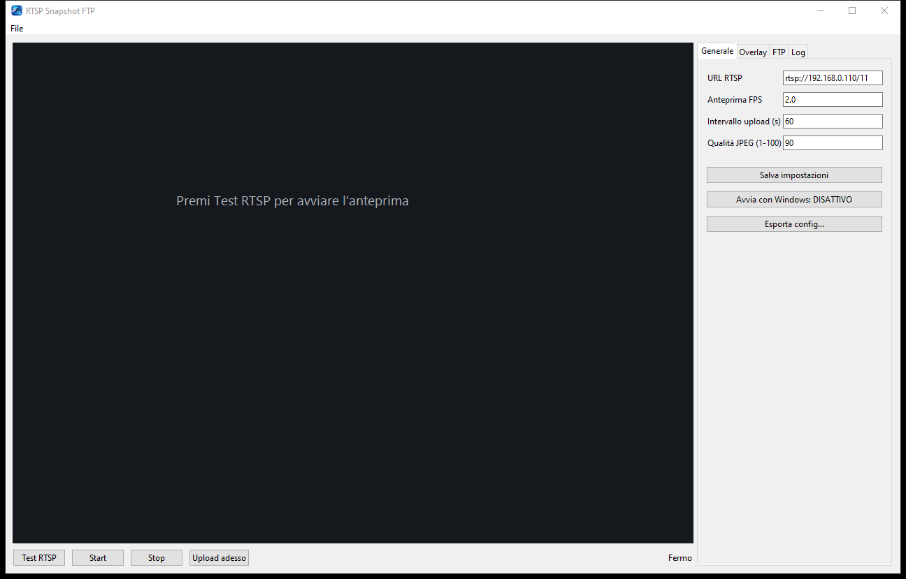

# RTSP Snapshot FTP

[Italiano](README.md) · **English** · [Deutsch](README.de.md)

<p align="center">
  
</p>

A Windows application that displays a low-frame-rate RTSP stream, applies a transparent PNG logo and a date/time overlay, and periodically uploads a JPEG image via FTP.

## Preview



## Features

- Editable RTSP URL (default: `rtsp://192.168.0.110/11`)
- Configurable low-frame-rate preview
- Transparent PNG logo that can be resized and dragged directly in the preview
- Date/time overlay with configurable format, font, size, colors, outline, and shadow
- Scheduled automatic uploads and manual uploads
- Separate RTSP and FTP connection tests
- Configurable JPEG quality
- Persistent settings stored in `%APPDATA%\RTSPSnapshotFTP\settings.json`
- Optional automatic startup with Windows
- JSON configuration export, with a choice to include or omit the FTP password
- Detailed FTP connection, authentication, and transfer log
- Closing the window with X minimizes the application to the notification area while video and uploads remain active
- File menu for saving, exporting, and importing settings, and for exiting the application
- Automatic service startup using the saved FTP settings
- RTSP over TCP, continuous anti-buffer reading, and automatic reconnection
- Full-screen preview by double-clicking; double-click again or press Esc to return
- FTP password stored locally in the settings file without encryption

## Development setup

Requires 64-bit Python 3.11.

```powershell
py -3.11 -m venv .venv
.\.venv\Scripts\python.exe -m pip install -r requirements.txt
.\.venv\Scripts\python.exe .\rtsp_ftp_app.py
```

## Building the standalone EXE

Run from PowerShell in the project directory:

```powershell
Set-ExecutionPolicy -Scope Process Bypass
.\build.ps1
```

The result is `dist\RTSP-Snapshot-FTP.exe`. The executable includes Python, OpenCV, Pillow, and OpenCV's FFmpeg backend. Python and FFmpeg do not need to be installed on the destination Windows 10/11 computer.

## Building the Windows installer

Install NSIS once on the computer used for building, then run:

```powershell
.\build-installer.ps1
```

The final installer is written to `outputs\RTSP-Snapshot-FTP-Setup.exe`. It installs the application for the current user, creates Desktop and Start Menu shortcuts, and registers the standard Windows uninstaller. No additional dependencies are required on the destination computer.

## Usage

1. Enter the RTSP URL.
2. Select the PNG and font, then drag the overlays into position in the preview.
3. Enter the FTP connection details and select **Test FTP**.
4. Set the upload interval and JPEG quality, then save the settings. On subsequent launches, the service starts automatically; **Start** remains available for a manual restart.

For best reliability, configure the camera to provide an H.264 substream with moderate resolution and bitrate. Standard FTP does not encrypt credentials or content and should only be used on a trusted network.
